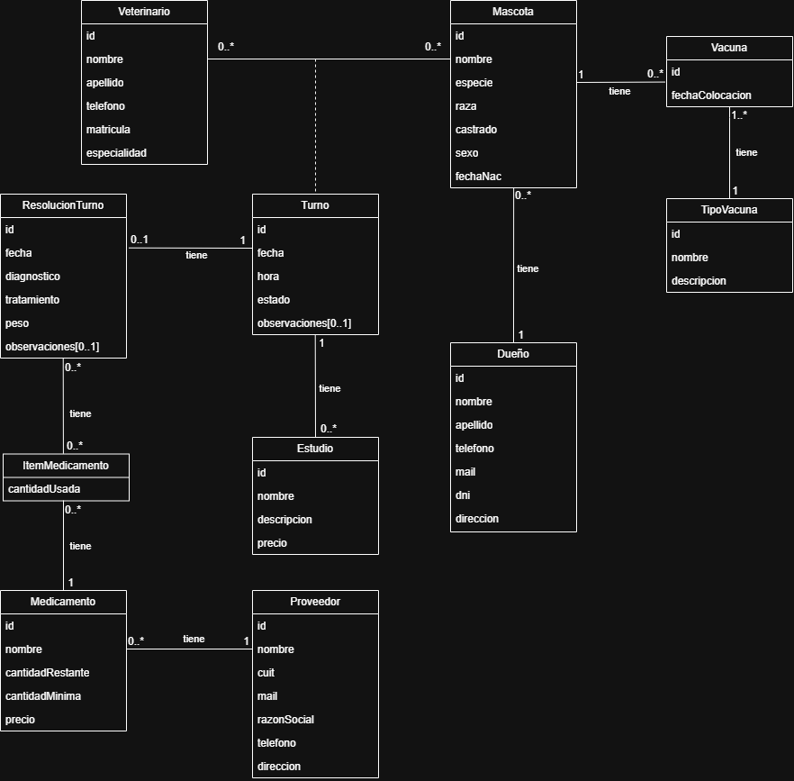

# Propuesta TP DSW

## Grupo
### Integrantes
* 54280 - Squarzon, Nicolás José
* 54448 - Grieco, Giuliana
* 55160 - Corbella, Leonardo Gabriel

### Repositorio
* [Fullstack app](https://github.com/ggiuliana/DSW-tp)

## Tema
### Descripción
Aplicación web para la gestión de una veterinaria que reúne la reserva de turnos, el historial clínico y el control de stock de medicamentos. El sistema optimiza la administración operativa y permite a los usuarios registrar tanto sus perfiles personales como los de sus mascotas.
### Modelo

## Alcance Funcional 

### Alcance Mínimo

Regularidad:
|Req|Detalle|
|:-|:-|
|CRUD simple|1. CRUD Veterinario 2. CRUD Dueño 3. CRUD Tipo Vacuna 4. CRUD Estudio|
|CRUD dependiente|1. CRUD Mascota {depende de} CRUD Dueño 2. CRUD Vacuna {depende de} CRUD Tipo Vacuna|
|Listado + detalle| 1. Listado de historia clínica por mascota => detalle de estudios realizados   2. Listado de turnos otorgados por veterinario en un rango de fechas determinado => detalle de agenda de Veterinario
|CUU/Epic|1. Agendar turno  2. Registrar resolución de turno junto a los estudios realizados|

Adicionales para Aprobación
|Req|Detalle|
|:-|:-|
|CRUD |1. CRUD Veterinario 2. CRUD Dueño 3. CRUD Tipo Vacuna 4. CRUD Vacuna 5. CRUD Estudio 6. CRUD Medicamento 7. CRUD Proveedor|
|CUU/Epic|1. Agendar turno  2. Registrar resolución de turno junto a los estudios realizados 3. Realizar pedido automático de medicamentos con poco o sin stock a proovedor|

### Alcance Adicional Voluntario

|Req|Detalle|
|:-|:-|
|Listados |1. Listado de medicamentos en stock y medicamentos faltantes  2. Listado de vacunas colocadas |
|CUU/Epic|1. Cancelar turno  2. Modificar turno|
|Otros|1. Envío de recordatorio de turno por email  2. Aviso de falta de stock|